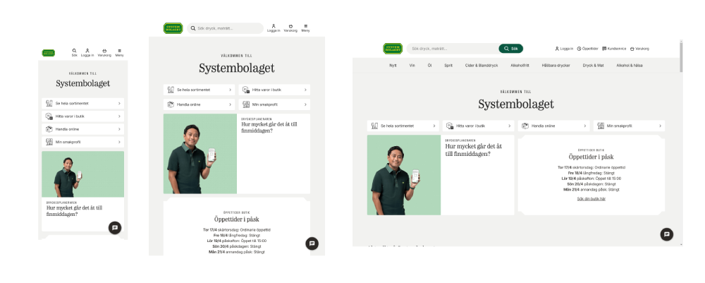
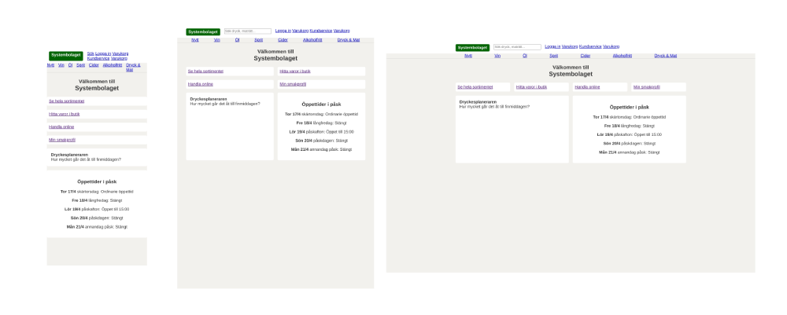
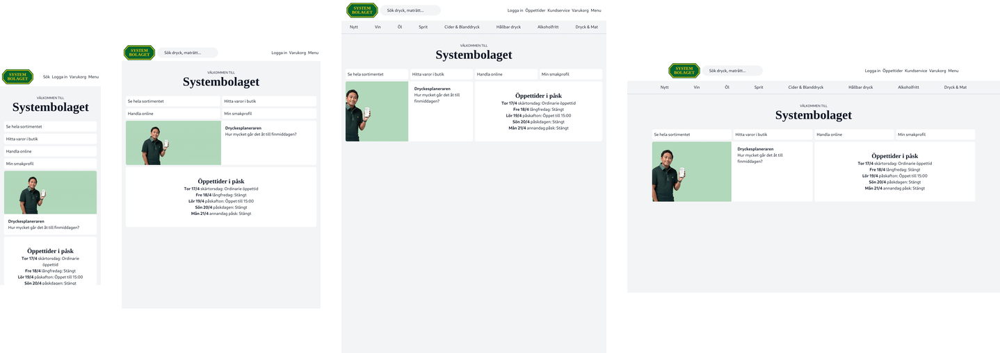

# Systembolagets vackra hemsida

https://gherghett.github.io/Systemet/

En liten utforsking av responsiv design när det gäller layour och grids i CSS
Har bara förskt efterlikna vilka områden som försvinner och dyker upp i plika upplösningar och hur columnerna och det ändrar sig i huvud-delen av sidan, inte så mycket kärlek till annat såsom färger och så.

Jag har gjort [samma sak fast med tailwind ](https://gherghett.github.io/Systemet/tailwind/)

## Original

## Min version

## En till fast gjord med tailwind

Anmärkningsvärt med tailwindversionen är att loggan som också är gjord helt med tailwind [Det finns en cool demo](https://github.com/gherghett/Systemet/logga) 

screenshot-collage genererade med https://github.com/gherghett/lineup-screenshots

Det finns [en AI-generad version också](https://gherghett.github.io/Systemet/generated/index.html).